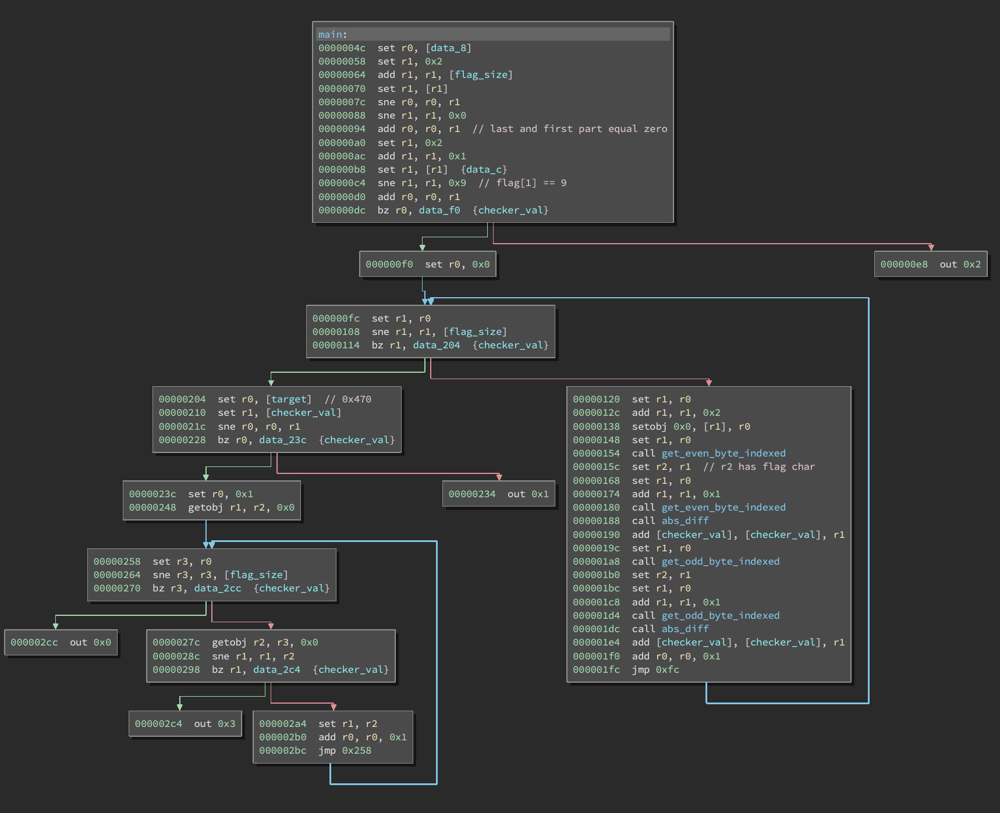

# Binary Ninja disassembler for PlaidCTF 2020 challenge "That's a lot of fish"

Each row in the VM is converted to 4 bytes in the rom.

The only binary that will probably ever make use of this plugin is [examples/rom.dat](./examples/rom.dat).

